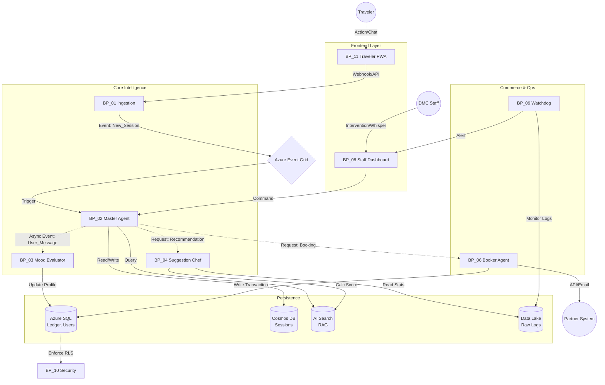

# FINNCONCIERGE - MASTER ARCHITECTURE MAP

Tämä dokumentti toimii ensisijaisena hakemistona ja riippuvuuskarttana FinnConcierge-projektille. Se määrittelee hakemistorakenteen, moduulien prioriteetit ja niiden väliset suhteet Azure Serverless -ympäristössä.

## 1. Directory Structure (Monorepo Strategy)

Tämä rakenne tukee Azure Functions (Python/Node.js) ja Next.js -hybridimallia.

```text
/finnconcierge-monorepo
├── .github/                        # CI/CD Workflows (Azure DevOps pipelines)
├── blueprints/                     # RAG-optimoitu arkkitehtuuridokumentaatio (Source of Truth)
│   ├── 00_VISION.md                # Business Logic & Win-Win-Win strategy
│   ├── 01_INGESTION.md             # Ingestion & Identity Service
│   ├── 02_MASTER_AGENT.md          # Master Orchestrator Logic
│   ├── 03_MOOD_EVALUATOR.md        # Profiling & Psychology Engine
│   ├── 04_SUGGESTION_CHEF.md       # Recommender System & Math
│   ├── 05_RAG_LIBRARIAN.md         # Vector Search & Data Ingestion
│   ├── 06_BOOKER_AGENT.md          # Transaction Router (API/Manual/Affiliate)
│   ├── 07_SHADOW_LEDGER.md         # Financial Consistency & Commission
│   ├── 08_STAFF_DASHBOARD.md       # Operational UI Logic
│   ├── 09_WATCHDOG.md              # Semantic Monitoring & Feedback Loop
│   ├── 10_INFRA_SECURITY.md        # RLS, GDPR, Azure Resources
│   └── 11_TRAVELER_UI.md           # PWA & Brand Engine
├── database/                       # SQL Migrations & Cosmos DB definitions
│   ├── sql/                        # Azure SQL Schemas (Ledger, Contracts)
│   └── cosmos/                     # NoSQL Containers (Sessions, Logs)
├── infrastructure/                 # IaC (Bicep / Terraform)
│   ├── event-grid/                 # Event Subscriptions & Topics
│   └── apim/                       # API Management policies
├── src/
│   ├── apps/
│   │   ├── traveler-pwa/           # Next.js 15 (Chameleon UI)
│   │   └── staff-dashboard/        # React Admin Panel
│   ├── functions/                  # Azure Functions (Microservices)
│   │   ├── ingestion/              # BP_01
│   │   ├── brains/                 # BP_02, BP_03, BP_04
│   │   ├── knowledge/              # BP_05 (RAG)
│   │   ├── commerce/               # BP_06, BP_07
│   │   └── ops/                    # BP_09 (Watchdog)
│   └── shared/                     # Shared Types, Utils, Constants
└── tests/                          # E2E & Integration Tests (Mystery Shopper Agents)
```

## 2. Blueprint Index & Priority Matrix

| Blueprint ID | Module Name | Role | Priority (MVP) | Complexity |
|--------------|-------------|------|----------------|------------|
| BP_01 | Ingestion & Identity | Entry Point, Magic Link, "First 5 Seconds" | CRITICAL | M |
| BP_02 | Master Agent | Orchestrator, Context "Backpack", Tone of Voice | CRITICAL | XL |
| BP_03 | Mood Evaluator | Async Profiler, Clustering, JSON State | CRITICAL | L |
| BP_04 | Suggestion Chef | Recommender (Math + AI), Scoring Formula | CRITICAL | XL |
| BP_05 | RAG Librarian | Knowledge Mgmt, Vector Indexes, "Shelves" | HIGH | L |
| BP_06 | Booker Agent | "Traffic Controller", API/Email Routing | CRITICAL | L |
| BP_07 | Shadow Ledger | Accounting, Commission Calc, Transaction Logs | HIGH | M |
| BP_08 | Staff Dashboard | "Traffic Lights", Whisper Mode, Takeover | CRITICAL | L |
| BP_09 | Watchdog & Insight | Semantic Monitoring, Auto-Correction, Analytics | MEDIUM | M |
| BP_10 | Infra & Security | GDPR, RLS, Event Grid Setup | CRITICAL | L |
| BP_11 | Traveler UI | "Chameleon" Brand Engine, PWA Logic | HIGH | M |
| Future | Holiday Builder | Pre-trip planning agent | PHASE 2 | XL |
| Future | Voice Mode | Voice-to-Voice interactions | PHASE 2 | L |

## 3. Dependency Graph (Event-Driven Flow)

Järjestelmä toimii Azure Event Gridin kautta. Agentit eivät kutsu toisiaan suoraan (tight coupling), vaan reagoivat tapahtumiin (loose coupling).



## 4. Next Steps for Agentic Coding

Jotta koodaus voidaan aloittaa, jokainen CRITICAL-tason Blueprint on määriteltävä atomisella tarkkuudella.

**Aloitusjärjestys (Logical Build Order):**

1. **BP_10 (Infra & Security)**: Tietokantojen skeemat (SQL/Cosmos) ja Event Gridin pystytys.
2. **BP_01 (Ingestion)**: Putki, jolla käyttäjä luodaan ja sessio alustetaan.
3. **BP_05 (RAG)**: Tiedon indeksointi, jotta agenteilla on "muisti".
4. **BP_02 (Master) & BP_03 (Mood)**: Keskustelulogiikka ja tilan hallinta.
5. **BP_04 (Chef)**: Suosittelualgoritmi.
6. **BP_06 & BP_07 (Commerce)**: Varausputki ja kirjanpito.
7. **UI**: Frontendin rakennus rajapintojen päälle.

